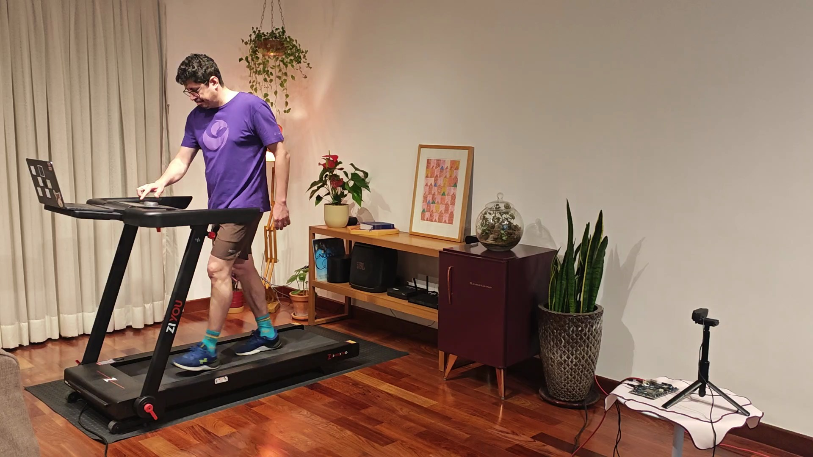
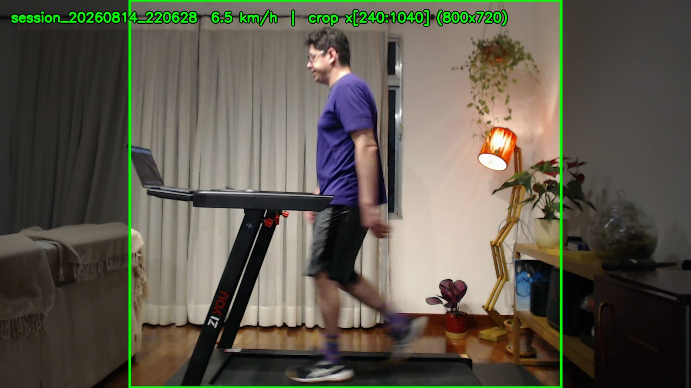
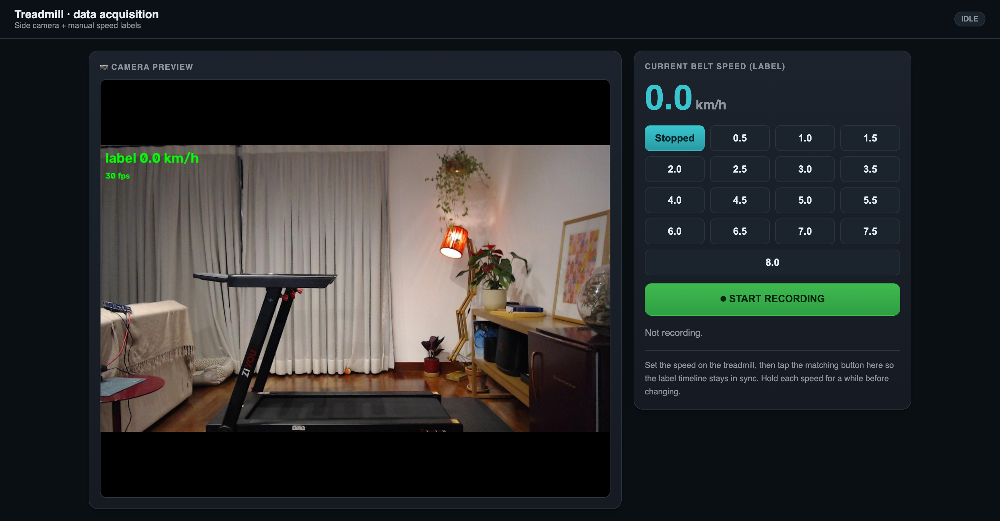
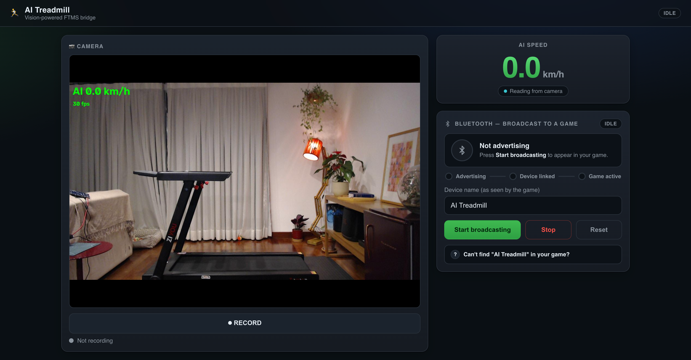

# AI Treadmill: Turn a Dumb Treadmill into a Bluetooth Smart Treadmill

*A personal edge-AI fitness project built with an Arduino VENTUNO Q, a USB camera, a video model, and Bluetooth FTMS.*



> **Note:** The VENTUNO Q shown in this project is a pre-production unit. The final production hardware may differ in appearance and configuration.

## Project overview

I have worked from home for years, and getting out of the house to exercise has become harder than it should be. Changing clothes, commuting to a gym, dealing with crowded rooms, and waiting for equipment all add friction. After a few doctors insisted that I needed to take exercise more seriously, my wife had a practical idea: rent a treadmill.

It helped, but only a little. After a few weeks, I still found my 3D printer more interesting than spending an hour walking in place.

So I tried to make the treadmill more fun.

I had seen people connect bikes and treadmills to virtual training games, and I wondered: could I do the same without modifying the treadmill? In my case this mattered a lot, because the treadmill was rented. I could not open it, drill it, add magnets, wire into the motor controller, or attach anything permanent. Could a small edge-AI computer simply **watch me walking**, estimate the belt speed from video, and send that speed to a game as if the treadmill were smart?

That became this project: a vision-powered virtual smart treadmill.

I also wanted the system to be local. A camera pointed at a treadmill is still a camera pointed inside my home, and I did not want those images or videos going to the Internet. The video stays on the device. The only thing that leaves the board is the estimated speed.

A USB webcam looks at the treadmill from the side. A 3D convolutional neural network runs locally on the Arduino VENTUNO Q and estimates the treadmill speed from a rolling one-second video clip. The board then advertises itself over Bluetooth Low Energy using FTMS, the standard Bluetooth Fitness Machine Service. FTMS is what lets many fitness games, phone apps, and BLE tools understand treadmills, bikes, rowers, and other exercise equipment. By speaking that standard, the board can appear as a normal smart treadmill to compatible apps.

The default public path runs the model on the CPU with ONNX Runtime because it is the easiest path to reproduce. After the full system was working, I also moved the same model to the VENTUNO Q's Hexagon HTP NPU through the Qualcomm AI Runtime. That optional NPU path kept the model output very close to the CPU version while reducing median inference latency from about 624 ms to 26.6 ms.

```text
dumb rented treadmill ──▶ USB camera ──▶ local CNN speed estimator ──▶ Bluetooth FTMS ──▶ game/app
```

No treadmill modification. No magnets. No optical encoder. No belt sensor. Just a camera, local AI, and a standard Bluetooth fitness profile.

## What you will build

By the end of this project, you will have:

- A local web app that shows a live camera feed and the AI-estimated treadmill speed.
- A trained video model exported to ONNX.
- A Bluetooth Low Energy FTMS peripheral called **AI Treadmill**.
- A way to pair a non-smart treadmill with compatible running apps or games.
- A reproducible training pipeline and public dataset so the model can be rebuilt.
- An optional NPU acceleration path using a QAIRT A16W8 context binary and `qnn-net-run`.

## Why Arduino VENTUNO Q fits this project

Arduino VENTUNO Q is an edge AI and robotics computer that combines Linux-class application processing with Arduino-style physical computing on one board. The board is built around a Qualcomm Dragonwing IQ8 / QCS8275 application processor for Linux, AI, camera, media, networking, and high-speed storage workloads, plus an STM32H5 microcontroller side for deterministic I/O, sensors, timers, and Arduino sketches.

This project uses the Linux/application side for camera capture, Python, ONNX Runtime, and Bluetooth. It is a good example of local-first edge AI: the camera frames stay on the device, inference runs locally, and only the resulting treadmill speed is sent over Bluetooth.

This version uses a standard Python and ONNX Runtime workflow as the default path, because it is easy to reproduce and debug. Once the full camera -> AI -> Bluetooth loop was working on the CPU, I also moved the same model onto the board's Hexagon HTP NPU for a large speedup - that optimization is written up in the "Moving the model from CPU to NPU" section near the end. Further directions could add extra sensors or use the Arduino MCU side for physical feedback such as LEDs, haptics, or safety controls.

## Components and supplies

### Hardware

| Quantity | Component | Notes |
|---:|---|---|
| 1 | Arduino VENTUNO Q | Runs the camera app, ONNX model, web UI, and BLE FTMS peripheral. |
| 1 | USB webcam | Tested with 1280x720 at 30 fps. A regular UVC webcam is enough. |
| 1 | Treadmill | Any belt treadmill. It does not need Bluetooth or sensors. |
| 1 | Power supply for the board | Use the power source recommended for the board and your peripherals. |
| 1 | Computer or phone running a fitness app | For example Zwift, Rouvy, nRF Connect, LightBlue, or another FTMS-compatible app. |
| Optional | GPU workstation | Only needed if you want to train the model from scratch. |

### Software and online services

| Tool | Purpose |
|---|---|
| Python 3 | Main runtime for data acquisition, preprocessing, inference, and BLE server. |
| OpenCV | Camera capture, video reading, frame preprocessing, and preview streaming. |
| NumPy | Data handling and training cache storage. |
| PyTorch + torchvision | Training the `mc3_18` video regression model. |
| ONNX Runtime | Default reproducible CPU inference path on the VENTUNO Q. |
| Qualcomm AI Runtime (QAIRT) | Optional NPU acceleration path using an A16W8 HTP V75 context binary. |
| bless | BLE peripheral implementation for the FTMS treadmill service. |
| bleak | Optional BLE central library used by the diagnostic probe. |
| gdown | Downloads the public dataset archive from Google Drive. |
| GitHub | Source code and trained ONNX model release. |

## Repository

Project repository:

```text
https://github.com/munoz0raul/treadmill
```

Main folders:

| Folder | Purpose |
|---|---|
| `1-data-acquisition/` | Record labeled treadmill videos, build the training cache, train the model, export ONNX. |
| `2-live-inference/` | Run the trained model live and show the estimated speed on a web page. |
| `3-bluetooth-ftms/` | Add Bluetooth FTMS so games can consume the AI speed. |
| `dataset_repro/` | Small reproducibility records in git, plus instructions for downloading the large videos/cache. |
| `docs/` | Article text and media placeholders. |

## Resources

Arduino VENTUNO Q: [product page](https://www.arduino.cc/product-ventuno-q/) · [store](https://store-usa.arduino.cc/products/ventuno-q) · [App Lab quickstart](https://docs.arduino.cc/software/app-lab/getting-started/quickstart/) · [App Lab Bricks](https://docs.arduino.cc/software/app-lab/bricks/about-bricks)

Qualcomm:

- **Dragonwing IQ8 series / IQ-8275 (QCS8275)** - the SoC the VENTUNO Q is built on. Dragonwing documentation is available at [dragonwingdocs.qualcomm.com](https://dragonwingdocs.qualcomm.com/).
- **Qualcomm AI Runtime SDK (QAIRT)** - the NPU toolchain for the optional NPU path. Free from the Qualcomm Software Center (the *Community* edition needs no login); search "Qualcomm AI Runtime SDK" and pick version 2.47.0.260601. The complete Project Hub flow is in the **Moving the model from CPU to NPU** section below.

## System diagram

There is no electrical connection to the treadmill. The camera observes the treadmill, and the VENTUNO Q pretends to be a smart treadmill over BLE.

```text
              USB video                      local inference
USB webcam ─────────────▶ Arduino VENTUNO Q ───────────────▶ speed_kmh
                              │                                  │
                              │ local web UI                     │ BLE FTMS
                              ▼                                  ▼
                     browser dashboard                 Zwift / Rouvy / BLE app

Real treadmill: mechanically unchanged, no sensors attached, no belt wiring.
```

## Camera placement

The model learns from motion, so camera placement matters more than camera quality.

Use a side view:

- Put the webcam on the side of the treadmill, roughly perpendicular to the belt.
- Place it around waist height.
- Keep the full body and the belt visible.
- Avoid placing the belt at the very edge of the frame.
- Use stable lighting and a fixed camera position.



The training and live scripts use a central horizontal crop of a 1280x720 frame:

```python
CROP_X0 = 240
CROP_X1 = 1040
```

That keeps an 800x720 center band containing the walker and belt while dropping room clutter. If your camera is framed differently, adjust the crop in both places:

- `1-data-acquisition/preprocess.py`
- `2-live-inference/live_speed.py`
- `3-bluetooth-ftms/game_server.py`

The crop used during training and inference must match.

## How to read the command blocks

Commands in this article run in one of two places:

- **VENTUNO Q**: the board connected to the camera and Bluetooth.
- **HOST machine**: your workstation used for training and for the optional NPU build. For the QAIRT/NPU conversion, this host must be an x86-64 Linux machine.

To keep the commands copy-pasteable, I do **not** put fake shell prompts like `device $` inside the code blocks. Instead, each block is introduced with a line such as:

```text
Run on: VENTUNO Q
Run on: HOST machine
```

When a command block says **Run on: VENTUNO Q**, type it in a terminal on the board. When it says **Run on: HOST machine**, type it on your host workstation. If you open a new terminal later, go back into the repository and set `REPO` again with `cd treadmill && export REPO="$PWD"`.

## VENTUNO Q: get the code and install runtime dependencies

Run on: **VENTUNO Q**.

Clone the repository directly into a `treadmill` folder. The runtime commands below keep generated files inside this repository folder, for example `models/speed_cnn.onnx` and `models/npu/`.

```bash
git clone https://github.com/munoz0raul/treadmill.git treadmill
cd treadmill
export REPO="$PWD"
```

Install the system packages used by the camera and Bluetooth stack:

```bash
sudo apt update
sudo apt install -y python3-venv python3-opencv bluez v4l-utils
sudo systemctl status bluetooth
```

Create a Python virtual environment inside the repo and install the VENTUNO Q runtime dependencies:

```bash
python3 -m venv venv
source venv/bin/activate
pip install -r requirements-board.txt
```

If you also want to run the BLE diagnostic probe from the board, install the debug requirements too:

```bash
pip install -r requirements-debug.txt
```

Find your USB camera:

```bash
v4l2-ctl --list-devices
```

In the examples below I use `/dev/video0`; replace it with your actual camera device if needed.

## Optional HOST machine: training dependencies

Run on: **HOST machine**.

You only need this section if you want to train or retrain the model. If you only want to run the released model on the VENTUNO Q, skip to **VENTUNO Q: download the trained model**.

```bash
git clone https://github.com/munoz0raul/treadmill.git treadmill
cd treadmill

python3 -m venv venv
source venv/bin/activate
pip install -r requirements-train.txt
pip install gdown
export REPO="$PWD"
```

The NPU conversion path uses the HOST machine too, but for that section the HOST machine must be x86-64 Linux.

## VENTUNO Q: download the trained model

Run on: **VENTUNO Q**.

If you only want to run the project, download the trained ONNX model into the repo's `models/` folder:

```bash
cd "$REPO"
source venv/bin/activate
mkdir -p models
curl -L -o models/speed_cnn.onnx \
  "https://github.com/munoz0raul/treadmill/releases/download/model-v1/speed_cnn.onnx"
```

The model is about 44 MB. The apps can load it from anywhere as long as you pass `--cnn-model`; in this article we keep it under `models/` inside the repository.

## Run live AI speed estimation

Start the Part 2 app:

Run on: **VENTUNO Q**.

```bash
cd "$REPO"
source venv/bin/activate
python3 2-live-inference/live_speed.py \
  --camera /dev/video0 \
  --port 8090 \
  --cnn-model models/speed_cnn.onnx
```

Open a browser at:

```text
http://<board-ip>:8090
```

You should see the live camera feed and a large speed readout. The estimator samples a rolling one-second video clip, runs the model with ONNX Runtime, applies a small motion gate for stopped-belt behavior, and smooths the result with a short rolling average.

Short live inference demo video: [watch on YouTube](https://youtu.be/9cKK7bAIcvc)

## Run the full Bluetooth treadmill app

Stop the Part 2 app and start the full Part 3 app:

Run on: **VENTUNO Q**.

```bash
cd "$REPO"
source venv/bin/activate
python3 3-bluetooth-ftms/game_server.py \
  --camera /dev/video0 \
  --port 8090 \
  --cnn-model models/speed_cnn.onnx
```

Open:

```text
http://<board-ip>:8090
```

Press **Start broadcasting**. The board advertises itself as:

```text
AI Treadmill
```

Now open your fitness game or BLE app and pair with **AI Treadmill**. In Zwift running mode, look under:

```text
Run -> Run Speed
```

Important: many BLE fitness devices do **not** appear in normal phone/tablet Bluetooth settings. Pair from inside the fitness app, or use a BLE scanner such as nRF Connect or LightBlue.

Bluetooth FTMS demo video: [watch on YouTube](https://youtu.be/-HMXbTs5wZ4)

## Optional: prepare for NPU acceleration

The Bluetooth treadmill command above uses the CPU by default. That path is intentionally simple:
install ONNX Runtime, download the ONNX model, and run the app. It is the default
reproducible path for this project.

For the final optimization pass, I also ran the same speed model on the VENTUNO
Q's Hexagon HTP NPU. That requires extra QAIRT artifacts staged on the board:

```text
models/npu/
├── bin/qnn-net-run
├── lib/...
├── dsp/...
└── speed_cnn_a16w8_htpv75.bin
```

The QAIRT tools and runtime libraries are **not bundled in this repository**.
They are Qualcomm-distributed SDK/runtime artifacts, and the compiled context
binary is a large generated file. The beginner-friendly public path remains the
CPU ONNX Runtime path above.

If you want the NPU version, you do **not** need to train the model from scratch
or record your own dataset. You can start from the released `speed_cnn.onnx` and
the public `dataset_repro.tar.gz` cache, then follow the full section **Moving
the model from CPU to NPU** later in this article. That section shows the complete
flow: install QAIRT on the HOST machine, convert the model, quantize it,
compile the HTP V75 context binary, copy the runtime to the VENTUNO Q, and run
the app with `--provider qnn`.

## Verify BLE with the FTMS probe

If a game does not pair, use the diagnostic probe from another computer that supports BLE scanning:

Run on: **HOST machine or VENTUNO Q**.

```bash
cd "$REPO"
source venv/bin/activate
pip install -r requirements-debug.txt
python3 3-bluetooth-ftms/ftms_probe.py --name "AI Treadmill"
```

A healthy run should pass these checks:

```text
[1] Scanning for 'AI Treadmill'...
  PASS  found device
[2] Connecting...
  PASS  connected
[3] Discovering GATT services...
  PASS  FTMS service 0x1826 present
[4] Reading discovery characteristics...
  PASS  Fitness Machine Feature 0x2ACC
  PASS  Supported Speed Range 0x2AD4
[5] Subscribing to Treadmill Data 0x2ACD...
  PASS  subscribed
[6] Control Point handshake...
  PASS  Request Control
  PASS  Start/Resume
[7] Watching speed...
  DATA 00002c01  speed=3.00 km/h
```

The FTMS treadmill stream sends speed at about 2 Hz. The important characteristic is `0x2ACD` Treadmill Data, where instantaneous speed is encoded in 0.01 km/h units. The app also exposes `0x2AD4` Supported Speed Range, because some games silently reject FTMS treadmills that do not provide it.

## Optional: train the model from scratch

The first lesson of this project was simple: if you want a useful AI model, you need useful data.

The treadmill itself could not tell me its speed, so I built a data acquisition web app. I set the speed on the treadmill, tapped the matching speed button in the browser, and walked. Each click was saved with a timestamp next to the video.



The public dataset contains 10 recording sessions and a prebuilt training cache. Download it from Google Drive:

Run on: **HOST machine**.

```bash
cd "$REPO"
source venv/bin/activate
pip install gdown
gdown 1V_-AhkDP4gH7HobBH-CnSRrkIpcf5Evp -O dataset_repro.tar.gz
tar -xzf dataset_repro.tar.gz
```

Then rebuild the cache:

```bash
python3 1-data-acquisition/preprocess.py \
  --sessions dataset_repro/session_* \
  --out dataset_repro/cache_side.npz
```

Expected cache:

```text
X shape: (8679, 3, 8, 112, 112)  dtype: uint8
y range: 0.0 -> 10.0 km/h
```

Train and export:

Run on: **HOST machine**.

This command needs PyTorch and torchvision from `requirements-train.txt`. It is
not expected to work in the VENTUNO Q runtime environment, because
that environment intentionally installs only the lighter board dependencies.

```bash
cd "$REPO"
source venv/bin/activate
pip install -r requirements-train.txt

mkdir -p models
python3 1-data-acquisition/train.py \
  --cache dataset_repro/cache_side.npz \
  --out models/speed_cnn.pt \
  --warmup 5 \
  --finetune 25

python3 1-data-acquisition/export_onnx.py \
  --ckpt models/speed_cnn.pt \
  --out models/speed_cnn.onnx
```

If you see `ModuleNotFoundError: No module named 'torch'`, you are either in the
VENTUNO Q runtime venv or the host training dependencies were not installed.
Switch to the HOST machine training setup and run `pip install -r
requirements-train.txt`.

I first tried to build a small video model myself, but my dataset was not large enough for that to work well. That was one of the points where the project became a learning exercise: good AI needs good data, and sometimes it also needs a good starting point. I looked for a video model that already understood motion, and used torchvision's `mc3_18` backbone pretrained on Kinetics-400 as that starting point.

The final model uses the pretrained `mc3_18` video backbone with the classifier replaced by a regression head that outputs speed in km/h. Each sample is 8 RGB frames spanning exactly 1 second, resized to 112 by 112 pixels.

The published training run produced a best validation mean absolute error of about **0.15 km/h** on a held-out session.

## Optional: record your own dataset

If your treadmill, camera angle, room lighting, or walking style is very different from mine, you may get better results by collecting your own data.

Run the acquisition tool:

Run on: **VENTUNO Q**.

```bash
cd "$REPO"
source venv/bin/activate
python3 1-data-acquisition/acquire.py \
  --camera /dev/video0 \
  --port 8080 \
  --dataset dataset
```

Open:

```text
http://<board-ip>:8080
```

Recommended recording protocol:

1. Set the treadmill speed.
2. Tap the matching speed button in the web UI.
3. Start recording.
4. Hold each speed for about 30 seconds.
5. Step through speeds from 0 to 8 km/h in 0.5 km/h increments.
6. Include at least one stopped/empty-belt recording.
7. Repeat across different days, people, clothing, and lighting conditions if possible.

Then build a cache and train as shown above.

## Moving the model from CPU to NPU

The first version ran the model on the **CPU** with ONNX Runtime. That made the project easy to reproduce and debug, and it is still the default path in this repository. But once the full camera to AI to Bluetooth loop was working, I wanted to see the same model run on the VENTUNO Q's **Hexagon HTP NPU**, the dedicated neural accelerator in the Qualcomm Dragonwing processor.

The catch is that this model is a 3D convolutional network: it convolves across time as well as space. ONNX Runtime's Qualcomm execution provider could not place those 5D `Conv3d` operations on the HTP in this project. They fell back to the CPU, which meant it was not a real NPU run. The path that worked was the **Qualcomm AI Runtime (QAIRT)** offline toolchain:

```text
speed_cnn.onnx
   -> qairt-converter              (ONNX to DLC intermediate)
   -> qairt-quantizer              (A16W8: 16-bit activations, 8-bit weights)
   -> qnn-context-binary-generator (compile for Hexagon HTP V75)
   -> speed_cnn_a16w8_htpv75.bin
```

That context binary runs on the board with `qnn-net-run`, and it is what `game_server.py --provider qnn` calls one clip at a time.

### Why these artifacts are not bundled

The QAIRT SDK and runtime libraries are Qualcomm-distributed artifacts, so I do not commit them to this repository. The generated HTP context binary is also a large build artifact, similar to the trained `.onnx` model. Instead, this section shows the exact reproduction path so you can regenerate the NPU files with your own QAIRT install.

You can follow this NPU section without training from scratch and without recording your own dataset. It starts from two public inputs:

1. the released `speed_cnn.onnx` model, and
2. the public `dataset_repro.tar.gz` archive, which contains the calibration cache used by the quantizer.

### What runs where

There are two machines involved:

- **HOST machine**: your workstation. For the QAIRT/NPU conversion, it must be x86-64 Linux.
- **BOARD**: the Arduino VENTUNO Q, which runs only the finished context binary and the small QAIRT runtime subset copied from the SDK.

The board itself does not compile the model.

Known-good versions from my reproduction:

```text
QAIRT:       2.47.0.260601
Target HTP:  V75
Python:      3.12
numpy:       1.26.4
onnx:        1.16.1
onnxruntime: 1.18.1
```

### Prepare the HOST machine

#### Create the host workspace

Run on: **HOST machine**.

Create a workspace anywhere you have enough disk space. The commands below use a local folder named `treadmill-npu-work`, then set `$WORK` to that current directory. This avoids hard-coding a home directory path.

```bash
mkdir -p treadmill-npu-work
cd treadmill-npu-work
export WORK="$PWD"
```

The NPU build will create this layout:

```text
$WORK/
├── treadmill/                  # git clone of this repository
├── qairt/2.47.0.260601/         # QAIRT SDK
├── .venv/                       # Python environment for QAIRT tools
├── llvm-libs/                   # local libc++ runtime extracted from .debs
├── speed_cnn.onnx               # model to convert
├── calib/                       # calibration .raw tensors + input_list.txt
├── ctx/                         # generated context binary output
└── npu-stage/                   # files copied to the VENTUNO Q
```

#### Install QAIRT on the HOST machine

Run on: **HOST machine**.

Download the **Qualcomm AI Runtime SDK**, Community edition, from the Qualcomm Software Center. I used version `2.47.0.260601`:

```bash
cd "$WORK"
# From the Qualcomm Software Center, "Qualcomm AI Runtime SDK", Community edition.
# If the direct URL redirects or 403s, download the same version in a browser.
wget "https://softwarecenter.qualcomm.com/api/download/software/sdks/Qualcomm_AI_Runtime_Community/All/2.47.0.260601/v2.47.0.260601.zip"
unzip v2.47.0.260601.zip          # creates ./qairt/2.47.0.260601/
export SDK="$WORK/qairt/2.47.0.260601"
```

Create a Python virtual environment for the QAIRT tools:

```bash
pip install --user --break-system-packages virtualenv
python3 -m virtualenv "$WORK/.venv"
source "$WORK/.venv/bin/activate"
```

Install the Python dependencies with the versions that worked with this SDK:

```bash
python3 "$SDK/bin/check-python-dependency"
pip install "numpy==1.26.4" "onnx==1.16.1" "onnxruntime==1.18.1"
```

Stage the LLVM `libc++` runtime used by the QAIRT native tools:

```bash
cd /tmp
apt-get download libc++1-18 libc++abi1-18 libunwind-18
for d in libc++1-18_*.deb libc++abi1-18_*.deb libunwind-18_*.deb; do
  dpkg-deb -x "$d" "$WORK/llvm-libs"
done
cd "$WORK"
export LLVM_LIBS="$WORK/llvm-libs/usr/lib/llvm-18/lib"
```

Put the QAIRT tools on `PATH` and verify the version:

```bash
source "$SDK/bin/envsetup.sh"
export LD_LIBRARY_PATH="$LLVM_LIBS:$LD_LIBRARY_PATH"
qairt-converter --version          # expected: 2.47.0.260601
```

#### Get the repo, model, and dataset on the HOST machine

Run on: **HOST machine**.

This is separate from the model you downloaded on the VENTUNO Q earlier. The QAIRT conversion runs on the host, so the host also needs its own copy of `speed_cnn.onnx`, plus the public dataset cache for calibration.

```bash
cd "$WORK"
if [ ! -d "$WORK/treadmill/.git" ]; then
  git clone https://github.com/munoz0raul/treadmill.git "$WORK/treadmill"
fi
export REPO="$WORK/treadmill"
cd "$REPO"

curl -L -o "$WORK/speed_cnn.onnx" \
  "https://github.com/munoz0raul/treadmill/releases/download/model-v1/speed_cnn.onnx"

pip install gdown
gdown 1V_-AhkDP4gH7HobBH-CnSRrkIpcf5Evp -O dataset_repro.tar.gz
tar -xzf dataset_repro.tar.gz

test -f dataset_repro/cache_side.npz
```

Create 64 QAIRT `.raw` calibration tensors from the public cache:

```bash
cd "$REPO"
python3 - <<'PY'
import os
import numpy as np

WORK = os.environ["WORK"]
cache = "dataset_repro/cache_side.npz"
if not os.path.exists(cache):
    raise SystemExit(
        f"Missing {cache}. Download dataset_repro.tar.gz with gdown and unpack it first."
    )

d = np.load(cache)
X = d["X"]  # uint8, shape (N,3,8,112,112)
os.makedirs(f"{WORK}/calib", exist_ok=True)

# Pick 64 clips spread across the cache so the quantizer sees the full dataset.
# Labels are not used for quantization; only representative input values matter.
idxs = np.linspace(0, len(X) - 1, 64, dtype=int)
for j, i in enumerate(idxs):
    clip = (X[i:i+1].astype(np.float32) / 255.0)  # add batch: (1,3,8,112,112)
    clip.tofile(f"{WORK}/calib/clip_{j:03d}.raw")
print(f"wrote {len(idxs)} calibration tensors to {WORK}/calib")
PY

find "$WORK/calib" -name 'clip_*.raw' | sort > "$WORK/calib/input_list.txt"
wc -l "$WORK/calib/input_list.txt"   # expected: 64
```

If the cache is missing but the videos are present, rebuild it first:

```bash
cd "$REPO"
python3 1-data-acquisition/preprocess.py \
  --sessions dataset_repro/session_* \
  --out dataset_repro/cache_side.npz
```

### Build the NPU model artifact

Run on: **HOST machine**.

Run the QAIRT tools from `$WORK`.

#### Convert ONNX to floating-point DLC

```bash
cd "$WORK"
qairt-converter \
  --input_network speed_cnn.onnx \
  --source_model_input_shape frames 1,3,8,112,112 \
  --output_path speed_fp.dlc
```

The released ONNX model has a dynamic batch axis on the input named `frames`. QAIRT needs the concrete shape, so this pins the live inference shape: batch 1, RGB channels 3, 8 frames, 112 by 112 pixels.

#### Quantize to A16W8

```bash
qairt-quantizer \
  --input_dlc speed_fp.dlc \
  --input_list calib/input_list.txt \
  --act_bitwidth 16 --weights_bitwidth 8 \
  --output_dlc speed_a16w8.dlc
```

This step can take a while. The quantizer runs the graph once for each calibration clip on the host CPU backend to collect activation ranges. With 64 video clips, a slow host can take tens of minutes. Seeing `QNN_CPU` in this calibration log is expected; the NPU execution happens later on the board.

I used A16W8 because the model outputs one continuous value, `speed_kmh`, with a small dynamic range. In plain INT8, that delicate output lost too much precision. 16-bit activations preserved it while 8-bit weights kept the model small and fast.

#### Compile the HTP V75 context binary

Create the QAIRT config files:

```bash
cat > htp_config.json <<'JSON'
{
  "graphs": [ { "graph_names": ["speed_a16w8"], "vtcm_mb": 0, "O": 3 } ],
  "devices": [ { "htp_arch": "v75" } ]
}
JSON

cat > backend_ext.json <<JSON
{
  "backend_extensions": {
    "shared_library_path": "$SDK/lib/x86_64-linux-clang/libQnnHtpNetRunExtensions.so",
    "config_file_path": "$WORK/htp_config.json"
  }
}
JSON
```

Generate the context binary:

```bash
mkdir -p ctx
qnn-context-binary-generator \
  --dlc_path speed_a16w8.dlc \
  --backend "$SDK/lib/x86_64-linux-clang/libQnnHtp.so" \
  --config_file backend_ext.json \
  --output_dir ctx \
  --binary_file speed_cnn_a16w8_htpv75
# creates ctx/speed_cnn_a16w8_htpv75.bin
```

That `.bin` is the model artifact the board runs.

### Stage the runtime for the VENTUNO Q

Run on: **HOST machine**.

This step starts on the host and copies files to the board. The board does not need the full QAIRT SDK. It only needs:

```text
<board-repo>/models/npu/
├── bin/qnn-net-run
├── lib/*.so
├── dsp/libQnnHtpV75Skel.so
└── speed_cnn_a16w8_htpv75.bin
```

Choose one aarch64 runtime target from the SDK. Do not copy from `aarch64-*` with a wildcard: the SDK contains several aarch64 variants with the same filenames, and `cp` can print “will not overwrite just-created ...” when they all try to land in the same destination.

List the available targets:

```bash
cd "$WORK"
find "$SDK/bin" -maxdepth 1 -type d -name 'aarch64-*' -printf '%f\n' | sort
find "$SDK/lib" -maxdepth 1 -type d -name 'aarch64-*' -printf '%f\n' | sort
```

For the VENTUNO Q image used in this project, the known-good target from the full reproduction is:

```bash
export QNN_TARGET="aarch64-oe-linux-gcc11.2"
echo "$QNN_TARGET"
```

Do not assume `aarch64-ubuntu-gcc9.4` is correct just because the board runs Linux. In QAIRT 2.47 that target may be missing HTP-specific files such as `libQnnHtpV75Stub.so`.

Create a clean staging folder and copy exactly that target's files:

```bash
cd "$WORK"
rm -rf "$WORK/npu-stage"
mkdir -p "$WORK/npu-stage/bin" "$WORK/npu-stage/lib" "$WORK/npu-stage/dsp"

# Fail early if the chosen target is incomplete.
test -x "$SDK/bin/$QNN_TARGET/qnn-net-run"
test -f "$SDK/lib/$QNN_TARGET/libQnnHtp.so"
test -f "$SDK/lib/$QNN_TARGET/libQnnHtpV75Stub.so"

cp "$SDK/bin/$QNN_TARGET/qnn-net-run"                  "$WORK/npu-stage/bin/"
cp "$SDK/lib/$QNN_TARGET/libQnnHtp.so"                 "$WORK/npu-stage/lib/"
cp "$SDK/lib/$QNN_TARGET/libQnnSystem.so"              "$WORK/npu-stage/lib/"
cp "$SDK/lib/$QNN_TARGET/libQnnHtpNetRunExtensions.so" "$WORK/npu-stage/lib/"
cp "$SDK/lib/$QNN_TARGET/libQnnHtpPrepare.so"          "$WORK/npu-stage/lib/"
cp "$SDK/lib/$QNN_TARGET/libQnnHtpV75Stub.so"          "$WORK/npu-stage/lib/"

# DSP-side HTP skel. This file is version-sensitive.
cp "$SDK/lib/hexagon-v75/unsigned/libQnnHtpV75Skel.so" "$WORK/npu-stage/dsp/"

# Context binary from the compile command above.
cp "$WORK/ctx/speed_cnn_a16w8_htpv75.bin"              "$WORK/npu-stage/"
```

The host staging folder should now look like this:

```text
$WORK/npu-stage/
├── bin/qnn-net-run
├── lib/libQnnHtp.so
├── lib/libQnnSystem.so
├── lib/libQnnHtpNetRunExtensions.so
├── lib/libQnnHtpPrepare.so
├── lib/libQnnHtpV75Stub.so
├── dsp/libQnnHtpV75Skel.so
└── speed_cnn_a16w8_htpv75.bin
```

Check it:

```bash
find "$WORK/npu-stage" -maxdepth 2 -type f | sort
```

Still on the host, set your board login, board IP address, and the absolute path to the repository on the VENTUNO Q. Do not leave placeholder values like `<board-user>` in the command.

```bash
export BOARD_USER="arduino"              # example only: use your VENTUNO Q username
export BOARD_IP="192.168.1.50"           # example only: use your VENTUNO Q IP address
export BOARD_REPO="/home/$BOARD_USER/treadmill"  # absolute path to the repo on the board
```

Create the destination directory on the board, then copy the staged files:

```bash
ssh "$BOARD_USER@$BOARD_IP" "mkdir -p '$BOARD_REPO/models/npu'"
scp -r "$WORK/npu-stage/"* "$BOARD_USER@$BOARD_IP:$BOARD_REPO/models/npu/"
```

If you see an error like `remote mkdir "/home/<board-user>/...": No such file or directory`, the placeholder was copied literally. Set `BOARD_USER` to the real board username and set `BOARD_REPO` to the absolute path where you cloned the repo on the board.

Verify from the host:

```bash
ssh "$BOARD_USER@$BOARD_IP" "find '$BOARD_REPO/models/npu' -maxdepth 2 -type f | sort"
```

The board should have:

```text
<board-repo>/models/npu/
├── bin/qnn-net-run
├── lib/libQnnHtp.so
├── lib/libQnnSystem.so
├── lib/libQnnHtpNetRunExtensions.so
├── lib/libQnnHtpPrepare.so
├── lib/libQnnHtpV75Stub.so
├── dsp/libQnnHtpV75Skel.so
└── speed_cnn_a16w8_htpv75.bin
```

> **Version-match gotcha.** My board firmware shipped QAIRT 2.46, while this context binary was built with QAIRT 2.47. Ship the matching 2.47 DSP skel above and let `game_server.py` point `ADSP_LIBRARY_PATH` at only that `dsp/` directory. Otherwise the firmware's older skel can win the version race and device creation can fail with error 1008.

### Run it live on the VENTUNO Q

Run on: **VENTUNO Q**.

First make sure the board checkout is on the branch that contains the NPU backend. If `game_server.py --help` does not show `--provider`, you are running an older copy of the code.

```bash
cd treadmill
export REPO="$PWD"
source venv/bin/activate
python3 3-bluetooth-ftms/game_server.py --help | grep -- '--provider'
```

Then run the app:

```bash
python3 3-bluetooth-ftms/game_server.py \
  --camera /dev/video0 \
  --port 8090 \
  --provider qnn \
  --npu-runtime models/npu \
  --npu-strict
```



Use `--npu-strict` when recording a demo or benchmark. It disables automatic CPU fallback, so if the NPU runtime is not available the app fails loudly instead of silently switching back to CPU.

The expected startup log is:

```text
NPU backend ready (Hexagon HTP V75) from models/npu
CNN estimator: provider=qnn (Hexagon HTP V75), clip span 1.00s
```

If you get `error: unrecognized arguments: --provider qnn --npu-runtime ...`, the NPU runtime files may be staged correctly, but the board is running an old `game_server.py`. Pull the branch above on the board and retry.

### Result: does the quantized model still agree with the CPU?

Comparing "walk on the CPU, then walk again on the NPU" would be unfair because no two walks are identical. So I did a **replay**: the CPU app dumped the exact input tensors it fed the model, and I ran those same tensors through the NPU. Any difference is then the engine and the quantization, not the walk.

Across **436 identical replayed clips**:

| Metric | CPU (float, ONNX Runtime) | NPU (A16W8, Hexagon HTP V75) |
|---|---|---|
| Median inference latency (p50) | 624 ms | **26.6 ms** |
| Agreement with the CPU output (MAE) | n/a | **0.054 km/h** |

That is about a **23.5x speedup** in per-inference latency, while the quantized NPU output stayed within **0.054 km/h** on average of the float CPU output on the same inputs, small enough to be invisible in the smoothed speed the game receives. The full benchmark report is in [`2-live-inference/bench/cpu_vs_npu.md`](../2-live-inference/bench/cpu_vs_npu.md).

## Troubleshooting

### The camera does not open

Check the device node:

```bash
v4l2-ctl --list-devices
```

Then pass the correct device:

```bash
python3 2-live-inference/live_speed.py --camera /dev/video2 --cnn-model models/speed_cnn.onnx
```

### The page opens but speed stays blank

Check that the ONNX model exists:

```bash
ls -lh models/speed_cnn.onnx
```

Also check the Python log. If ONNX Runtime is missing, reinstall the board requirements:

```bash
pip install -r requirements-board.txt
```

### The speed reads nonzero when the treadmill is stopped

The motion gate forces very-low-motion clips to 0.0 km/h, but camera noise, lighting flicker, or moving background objects can still affect the signal. Improve lighting, keep the camera fixed, and make sure the crop mostly contains the treadmill and walker.

### The game cannot find the treadmill

- Start broadcasting from the web UI.
- Pair from inside the game, not from the operating system Bluetooth settings.
- Verify that BlueZ is running:

```bash
sudo systemctl status bluetooth
```

- Run the FTMS probe:

```bash
python3 3-bluetooth-ftms/ftms_probe.py --name "AI Treadmill"
```

### The game connects and disconnects immediately

This is often an FTMS compatibility issue. The probe checks the two pieces that mattered most in my testing:

- `0x2AD4` Supported Speed Range exists and is readable.
- `0x2AD9` Control Point acknowledges Request Control and Start.

## Safety notes

This project does not control the treadmill. It only observes the belt and broadcasts an estimated speed. Still, use common sense:

- Do not adjust code, cables, or the camera while walking or running.
- Keep cables away from the belt.
- Use a stable camera mount.
- Do not rely on this project for medical, safety, or emergency use.
- Stop the treadmill if the game or web UI distracts you.

## What I learned

The fun part was making exercise feel a little more like play. The hard part was the data.

I expected the model architecture to be the main challenge. In practice, the biggest lesson was that a good model starts with a good dataset. I had to record sessions at different speeds, keep labels aligned with video time, correct frame-rate issues, and make sure training and live inference sampled clips the same way.

The second lesson was that standards matter. Bluetooth fitness devices speak FTMS, and games expect a very specific GATT shape. Adding the Supported Speed Range characteristic and implementing the Control Point handshake turned an unreliable pairing experiment into something that behaved like a real treadmill.

Now the only remaining experiment is the personal one: will making the treadmill more playful help me use it every day?

## Next steps

Ideas for future improvements:

- Package the NPU path so QAIRT runtime staging is simpler and the acceleration is one flag away.
- Add an Arduino-side LED, display, or haptic feedback module.
- Improve generalization across more treadmill models and camera angles.
- Package the app as a service that starts automatically on boot.
- Add cadence or stride analysis in addition to belt speed.

## AI collaboration note

I have always loved having ideas. The difference now is that AI tools help me turn those ideas into working prototypes much faster. I do not want to pretend that I typed every line of this project alone. I used AI as a collaborator for code, debugging, documentation, and iteration. At the end, I personally reproduced the scripts and commands in this article to validate the process.

## Credits and license

This is a personal project. Source code is released under the [Mozilla Public License 2.0](../LICENSE).
